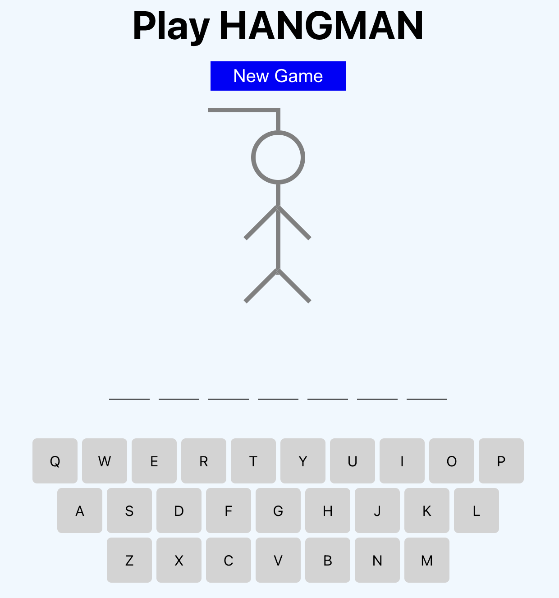
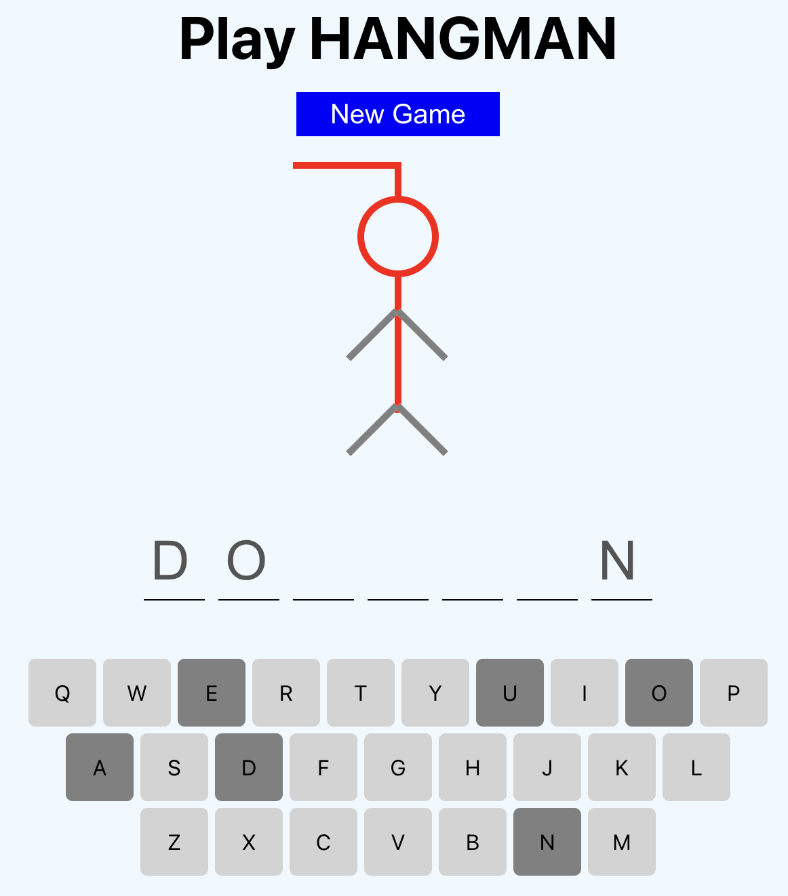
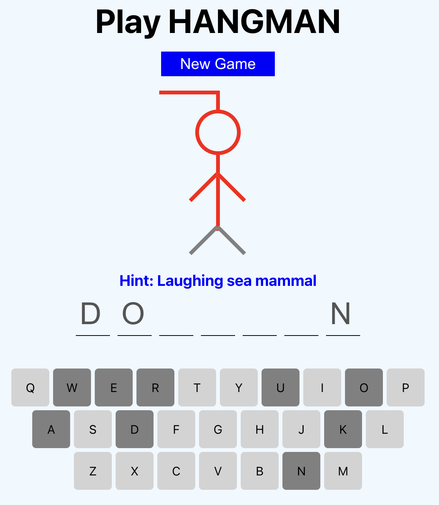
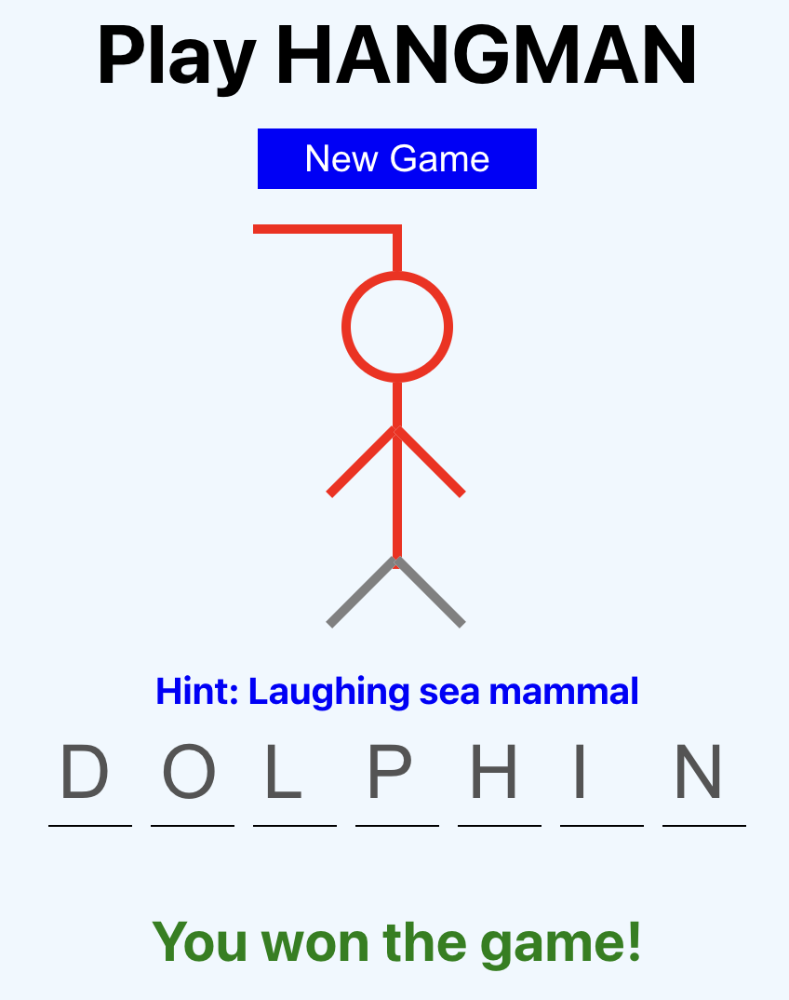

# Hangman-Game-React
Hangman Game using React.

### HOW TO RUN:
```console
npm install
npm start
```

### HOW TO PLAY:
1. The player guesses a letter by clicking on the virtual keyboard.
2. If the guessed letter is in the word, it is revealed in the correct positions of the word.
3. If the guessed letter is not in the word, a part of the hangman drawing is filled with .
4. After 5th wrong attempt, a  is shown.
5. After 7th wrong attempt, the user loses the game.

### SCREENSHOTS:
<kbd></kbd>    <kbd></kbd>
<br/><br/>
<kbd></kbd>    <kbd></kbd>
